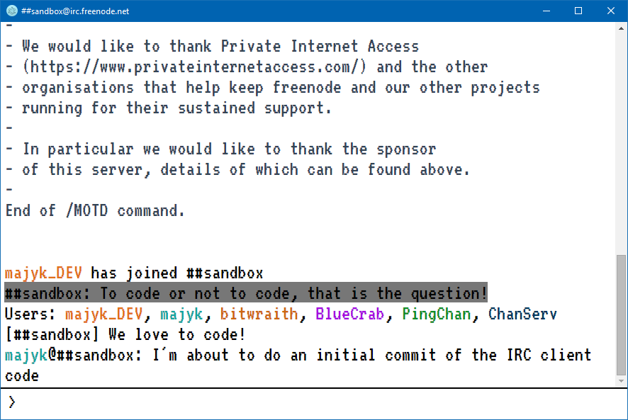

# simple-irc-client
A simple IRC client built on Electron

## Screenshot



## Status

Works but is not complete. Things may be broken and this README may make claims that simply do no work (yet).

## Building From Source

Requires: [Node.JS](https://nodejs.org)

If you are familiar with Electron all the code in this repository would be in your /Resources/App folder (assuming the code is built, you'll need to build the code since I do not ship a build in the repo).

**WARNING**: There are no detailed build instructions. This is just a typical build using npm, bower and grunt.

Requires Node.JS, bower, grunt

- npm install
- bower install
- grunt to build

## Usage

The entire app is command line driven. Once running you'll be presented a command line where you'll need to login to an IRC server.

```
/login irc.freenode.net your_nick ##your_channel
```

The login command accepts an array of channels, so you can specify as many as you like. Those channels are space delimited.

You can identify with nickserv (only tested with FreeNode) like this:

```
/identify <password>
```

You can disconnect from the server like this:

```
/disconnect
```

You can join channels like this:

```
/join #channel_name
```

You can leave a channel like this:

```
/part ##channel_name
```

You can switch between channels that you have already joined by doing:

```
/channel #channel_name
```

Other commands which are not listed in any particular order:

You can list a channel's topic by doing this:

```
/topic ##channel_name
```

You can list the channels you have joined by doing this:

```
/listChannels
```

Open the developer tools:

```
/devtools
```

Restart the application:

```
/restart
```

List the nicks that are in the current channel:

```
/nicks
```

Clear the window:

```
/clear
```

## License

GNU GPL v3 - see [LICENSE](LICENSE)

## Author(s)

Frank Hale &lt;frankhale@gmail.com&gt;  
19 November 2015
