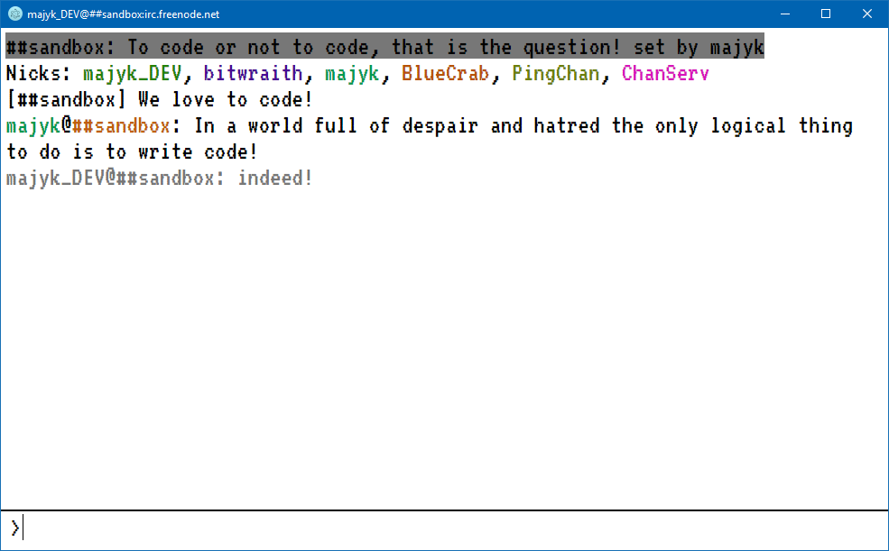

# simple-irc-client
A simple IRC client built on Electron

## Screenshot

## Status

Works but with limitations.

**Limitations (will be resolved soon)**:

- There are no instructions yet on how to build and run the code.
- Only supports one IRC channel.
- Currently you have to edit the source code to specify a nick and channel to join.
- No app icon (so the Electron default is being used)

**NOTE (Building Source Code)**

If you are familiar with Electron all the code in this repository would be in your /Resources/App folder (assuming the code is built).

## License

GNU GPL v3 - see [LICENSE](LICENSE)

## Author(s)

Frank Hale &lt;frankhale@gmail.com&gt;  
17 November 2015
